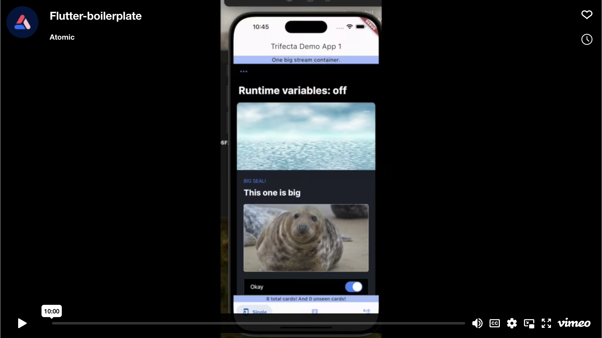

# Multiple Containers Demo App

The first Flutter demo app for Atomic.io. This app's purpose is intended to demonstrate the impact having a complex implementation of the Atomic SDK can have on the app's performance and user experience. It includes numerous containers, state changes, and animations.

In the app root directory, remember to create a `.env` file with the following set:
```
API_KEY=''
API_URL=''
USER_ID=''
```

Also, remember to place the generated `jwtRS512.key` file in an assets folder in the app root directory like this: `assets/jwtRS512.key`

Here is a video of the app: 


[](https://vimeo.com/886289796/315a0adb80)

For more information about settings and Atomic SDK usage, read the docs: [Installing Atomic SDKs](https://documentation.atomic.io/sdks/install) and [Flutter SDK](https://documentation.atomic.io/sdks/flutter).